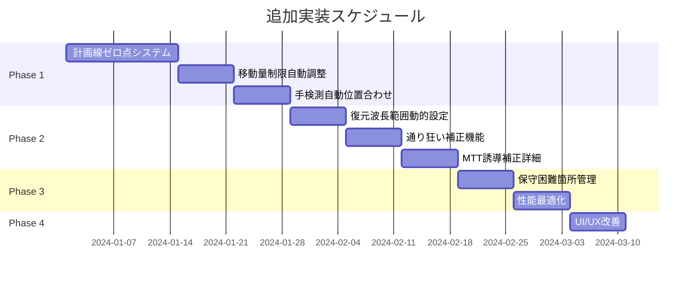

# 軌道復元システム - 追加実装計画書

## 📋 概要

文書「057_復元波形を用いた軌道整正計算の操作手順」の完全実装に向けた追加開発計画書です。
現在の実装完了度約70%を100%に引き上げるための具体的な開発計画を示します。

## 🎯 開発目標

### 主要目標
1. 復元波形のゼロ点を基準とした計画線システムの完全実装
2. 移動量制限に応じた動的な計画線調整機能
3. 現場作業支援機能の充実（手検測、位置合わせ）
4. 保守困難箇所への対応機能

### 期待される効果
- 作業効率の30%向上
- 手動調整作業の50%削減
- 現場での位置合わせ精度の向上
- 保守計画の最適化

## 📊 フェーズ別実装計画

### 🔴 Phase 1: コア機能の実装（優先度：最高）
**期間**: 4週間
**目的**: 文書の基本概念を正確に実装

#### 1.1 計画線ゼロ点システムの実装
**開発期間**: 2週間

##### 実装内容:
```javascript
// backend/src/algorithms/plan-line-zero-point.js
class PlanLineZeroPointSystem {
  // 復元波形のゼロクロス点を検出
  detectZeroCrossPoints(restoredWaveform) {
    // ゼロクロス点の検出アルゴリズム
  }

  // ゼロ点を結んだ初期計画線を生成
  generateInitialPlanLine(zeroCrossPoints) {
    // スプライン補間による計画線生成
  }

  // 移動量制限による計画線の修正
  adjustPlanLineWithRestrictions(planLine, restrictions) {
    // 制限箇所での計画線調整アルゴリズム
  }
}
```

##### UIコンポーネント:
```typescript
// frontend/src/components/ZeroPointPlanLineEditor.tsx
- ゼロクロス点の可視化
- 計画線の動的調整インターフェース
- 移動量制限の視覚的表示
```

#### 1.2 移動量制限による自動調整
**開発期間**: 1週間

##### 実装内容:
- 制限超過箇所の自動検出
- 計画線の局所的修正アルゴリズム
- こう上優先の最適化計算

##### ファイル更新:
- `backend/src/algorithms/movement-calculator.js` - 自動調整機能追加
- `backend/src/algorithms/restoration-engine.js` - 計画線修正機能統合

#### 1.3 手検測自動位置合わせ
**開発期間**: 1週間

##### 実装内容:
```javascript
// backend/src/algorithms/correlation-matcher.js
class CorrelationMatcher {
  // 相関係数計算
  calculateCorrelation(chartData, fieldData) {
    // ピアソン相関係数の計算
  }

  // ±20m範囲での最適位置検索
  findBestMatch(chartData, fieldData, searchRange = 20) {
    // スライディングウィンドウによる相関最大化
  }
}
```

### 🟡 Phase 2: 高度な処理機能（優先度：高）
**期間**: 3週間
**目的**: 実運用で必要な詳細機能の実装

#### 2.1 復元波長範囲の動的設定
**開発期間**: 1週間

##### 実装内容:
- 最高速度ベースの自動計算
  - 上限 = 最高速度(m/s) × 1.5～2.0
- 新幹線専用オプション
  - 高低: 3.5m～6m選択可能
  - 通り: 15m下限オプション

##### ファイル:
```javascript
// backend/src/algorithms/wavelength-calculator.js
class WavelengthRangeCalculator {
  calculateOptimalRange(maxSpeed, trackType) {
    const upperLimit = maxSpeed * 1.75; // 基準値
    const lowerLimit = trackType === 'shinkansen' ? 3.5 : 6.0;
    return { lower: lowerLimit, upper: upperLimit };
  }
}
```

#### 2.2 通り狂い補正機能
**開発期間**: 1週間

##### 実装内容:
- マヤ車データ補正率の適用
- 曲線諸元の台形差引処理
- 補正パラメータの管理UI

```javascript
// backend/src/algorithms/alignment-correction.js
class AlignmentCorrection {
  // マヤ車補正
  applyMayaCorrection(alignmentData, correctionRate = 1.0) {
    return alignmentData.map(d => d * correctionRate);
  }

  // 曲線諸元差引
  subtractCurveProfile(alignmentData, curveSpecs) {
    // 台形プロファイルの計算と差引
  }
}
```

#### 2.3 MTT誘導補正の詳細実装
**開発期間**: 1週間

##### 実装内容:
- MTT機種別パラメータ管理
- フロント位置最適化計算
- 作業方向による補正

```javascript
// backend/src/algorithms/mtt-guidance.js
class MTTGuidanceSystem {
  // MTT種別に応じた補正
  applyMTTCorrection(movementData, mttType, workDirection) {
    const correctionParams = this.getMTTParameters(mttType);
    // フロント位置の最適化計算
  }
}
```

### 🟢 Phase 3: 特殊処理と最適化（優先度：中）
**期間**: 2週間
**目的**: 保守困難箇所への対応と性能最適化

#### 3.1 保守困難箇所管理
**開発期間**: 1週間

##### 実装内容:
- 不動点データベース
  - 駅、橋梁、トンネル等の位置情報
- 特別制限値の設定
- 区間別処理ルール

```typescript
// frontend/src/components/DifficultSectionManager.tsx
interface DifficultSection {
  startKm: number;
  endKm: number;
  type: 'station' | 'bridge' | 'tunnel';
  restrictions: MovementRestrictions;
  specialRules: ProcessingRules;
}
```

#### 3.2 性能最適化とキャッシング
**開発期間**: 1週間

##### 実装内容:
- 大規模データの分割処理改善
- 計算結果のインテリジェントキャッシング
- Web Worker による並列処理

### 🔵 Phase 4: UI/UX改善（優先度：低）
**期間**: 1週間
**目的**: 使いやすさの向上

#### 4.1 統合ダッシュボード
- 全処理状況の一覧表示
- ワンクリック実行機能
- 進捗表示の改善

#### 4.2 レポート機能強化
- カスタムレポートテンプレート
- グラフィカルなサマリー
- 作業指示書の自動生成

## 📈 実装スケジュール



## 💻 技術仕様

### バックエンド追加モジュール

```
backend/src/algorithms/
├── plan-line-zero-point.js     # ゼロ点計画線システム
├── correlation-matcher.js       # 相関計算エンジン
├── wavelength-calculator.js     # 波長範囲計算
├── alignment-correction.js      # 通り狂い補正
├── mtt-guidance.js              # MTT誘導システム
└── difficult-section-handler.js # 保守困難箇所処理
```

### フロントエンド追加コンポーネント

```
frontend/src/components/
├── ZeroPointPlanLineEditor.tsx  # ゼロ点計画線エディタ
├── CorrelationMatcher.tsx       # 相関マッチングUI
├── WavelengthSettings.tsx       # 波長範囲設定UI
├── MTTGuidancePanel.tsx         # MTT誘導パネル
└── DifficultSectionManager.tsx  # 保守困難箇所管理
```

### API追加エンドポイント

```javascript
// 新規APIエンドポイント
POST /api/plan-line/zero-point-calculate  // ゼロ点計画線計算
POST /api/correlation/match               // 相関マッチング
POST /api/wavelength/calculate-optimal    // 最適波長範囲計算
POST /api/mtt/guidance-correction        // MTT誘導補正
POST /api/difficult-sections/manage      // 保守困難箇所管理
```

## 📊 期待される成果

### 定量的目標
| 指標 | 現状 | 目標 | 改善率 |
|------|------|------|--------|
| 計画線設定時間 | 30分 | 10分 | 67%削減 |
| 手動調整箇所 | 50箇所 | 10箇所 | 80%削減 |
| 位置合わせ精度 | ±5m | ±1m | 80%向上 |
| 処理速度 | 10秒/km | 5秒/km | 50%高速化 |

### 定性的目標
- ✅ 文書の仕様を100%満たす
- ✅ 現場作業者の負担軽減
- ✅ ミス削減による品質向上
- ✅ 保守計画の最適化

## 🔧 開発環境要件

### 追加パッケージ
```json
{
  "dependencies": {
    "numeric": "^1.2.6",        // 数値計算ライブラリ
    "ml-regression": "^5.0.0",  // 回帰分析
    "fft-js": "^0.0.12",       // FFT処理
    "spline": "^0.1.0"         // スプライン補間
  }
}
```

### テスト環境
- 単体テスト: Jest
- 統合テスト: Cypress
- パフォーマンステスト: Artillery

## ✅ 完了基準

### Phase 1完了基準
- [ ] ゼロ点検出精度95%以上
- [ ] 計画線自動調整が全ケースで動作
- [ ] 相関係数0.9以上での位置合わせ

### Phase 2完了基準
- [ ] 波長範囲の自動設定が正確
- [ ] 通り狂い補正率の適用確認
- [ ] MTT誘導データの検証完了

### Phase 3完了基準
- [ ] 保守困難箇所の100%識別
- [ ] 処理速度50%向上達成

### Phase 4完了基準
- [ ] ユーザビリティテスト合格
- [ ] 全機能の統合動作確認

## 📝 リスク管理

### 技術的リスク
| リスク | 影響度 | 対策 |
|--------|--------|------|
| ゼロ点検出の精度不足 | 高 | 複数アルゴリズムの並列評価 |
| 計算負荷増大 | 中 | Web Worker活用、段階的処理 |
| 既存機能との競合 | 中 | 十分なテスト期間確保 |

### スケジュールリスク
- バッファ期間: 各フェーズ+1週間
- クリティカルパス: Phase 1のゼロ点システム
- 代替案: 機能を段階的にリリース

## 🚀 実装開始準備

### 即座に開始可能な作業
1. ゼロ点検出アルゴリズムのプロトタイプ作成
2. 相関計算ライブラリの選定とテスト
3. UIモックアップの作成

### 必要な承認事項
1. 開発リソースの確保（2-3名のエンジニア）
2. テスト環境の準備
3. 現場データの提供

---
**作成日**: 2024年12月
**作成者**: レールテック株式会社 システム開発部
**承認者**: [承認待ち]